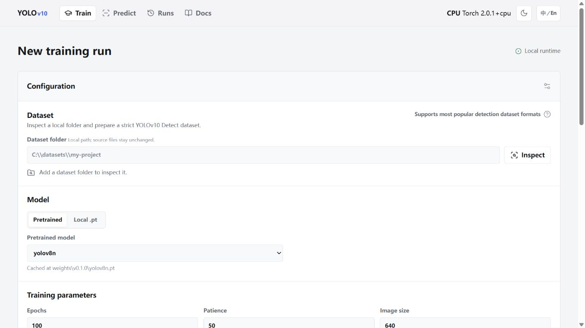
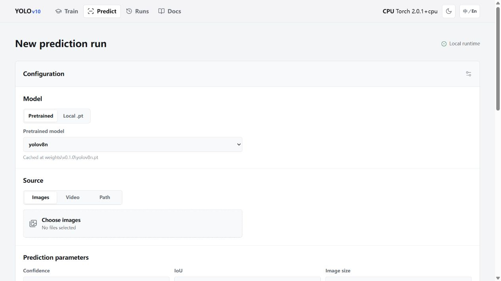
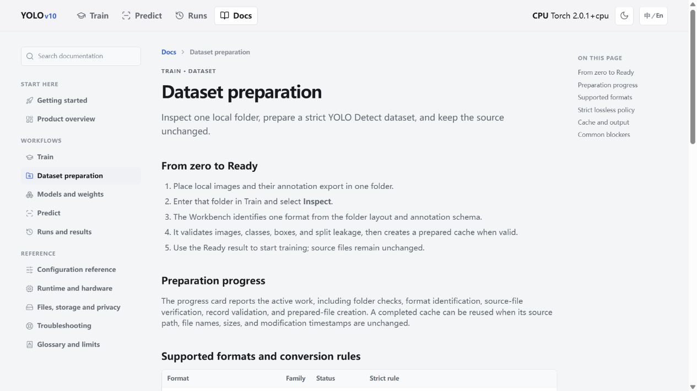

<div align="center">

# YOLO-WebUI

[中文](README.zh-CN.md) | **English**

<p><strong>A local-first visual workbench for preparing detection datasets, training YOLO models, and reviewing prediction results.</strong></p>

<p>
  
  
  
  
  
</p>

</div>

## Overview

YOLO-WebUI is a self-hosted interface for the local Ultralytics Detect workflow. It keeps datasets, model weights, run outputs, and logs on the machine where it runs. The application is designed for a focused single-user workflow rather than hosted collaboration or a multi-tenant service.

The repository contains the matching Ultralytics source tree. Run the service from this checkout so the UI and its bundled runtime stay aligned.

## Highlights

- **Dataset-first training:** inspect one local folder, identify a supported detection format, validate it, and prepare a strict YOLO Detect cache without changing the source files.
- **Practical model handling:** choose a pretrained model with verified local caching, or use a local `.pt` file or upload.
- **Focused prediction:** run on image uploads, a video upload, or a local path. URL sources are intentionally not supported.
- **Visible run lifecycle:** one managed run at a time, with live status, command preview, logs, charts, weights, media previews, and a searchable run history.
- **Product documentation:** built-in Docs includes format conversion rules, parameter reference, runtime behavior, storage guidance, and recovery steps.
- **Bilingual interface:** the top-bar `中/En` control follows the system language initially and lets each browser choose English or Chinese.

## Screenshots

<table>
  <tr>
    <td width="50%" valign="top"><strong>Dataset preparation and training</strong><br><br></td>
    <td width="50%" valign="top"><strong>Image, video, and path prediction</strong><br><br></td>
  </tr>
  <tr>
    <td colspan="2" valign="top"><strong>In-product documentation</strong><br><br></td>
  </tr>
</table>

## Requirements

- Git
- [Conda](https://docs.conda.io/projects/conda/en/latest/user-guide/install/) (Miniconda or Anaconda)
- Windows, macOS, or Linux
- Optional: NVIDIA GPU with a driver compatible with CUDA 11.8

> [!IMPORTANT]
> Choose one installation path below. Use CUDA 11.8 first when the target Windows or Linux machine has a compatible NVIDIA driver; use CPU on machines without CUDA support, including macOS.

## Quick start

### NVIDIA GPU · CUDA 11.8 (Windows or Linux)

```bash
git clone https://github.com/LeoWang0814/YOLO-WebUI.git yolov10-workbench
cd yolov10-workbench

conda create -n yolov10 python=3.10
conda activate yolov10

pip install -r requirements-cuda118.txt
pip install -e .

python -c "import torch; print(torch.__version__, torch.cuda.is_available())"
python app.py
```

The CUDA check must print `True` before choosing a GPU in the Workbench. Open [http://127.0.0.1:7860](http://127.0.0.1:7860) after launch.

> [!NOTE]
> Dependency files do not force a download source. Configure your preferred pip mirror before the install command when needed. For CUDA 11.8, use a mirror that provides the matching PyTorch CUDA wheel, or install that wheel from your chosen source first.

### CPU only (Windows, macOS, or Linux)

```bash
git clone https://github.com/LeoWang0814/YOLO-WebUI.git yolov10-workbench
cd yolov10-workbench

conda create -n yolov10 python=3.10
conda activate yolov10

pip install -r requirements.txt
pip install -e .

python app.py
```

Open [http://127.0.0.1:7860](http://127.0.0.1:7860).

## Launch options

`python app.py` listens on `127.0.0.1:7860` by default. Set these environment variables before launching when a different address or port is needed.

| Purpose | Windows PowerShell | macOS / Linux |
| --- | --- | --- |
| Expose on the local network | `$env:YOLOV10_WEBUI_HOST="0.0.0.0"` | `export YOLOV10_WEBUI_HOST=0.0.0.0` |
| Use port 7862 | `$env:YOLOV10_WEBUI_PORT="7862"` | `export YOLOV10_WEBUI_PORT=7862` |
| Start the service | `python app.py` | `python app.py` |

For example, on Windows PowerShell:

```powershell
$env:YOLOV10_WEBUI_HOST="127.0.0.1"
$env:YOLOV10_WEBUI_PORT="7862"
python app.py
```

> [!WARNING]
> Binding to `0.0.0.0` exposes the service to devices that can reach the machine. The Workbench has no authentication layer; use a private network or a reverse proxy with access control before sharing it.

## First workflow

1. Open **Train** and enter the folder containing your images and annotations.
2. Select **Inspect**. The Workbench identifies the dataset format, validates records, and prepares a cache only when strict conversion is possible.
3. Select a pretrained model or provide a local `.pt` model. Configure the main training fields and review the generated command.
4. Start training. Watch live progress and logs; outputs are stored under `runs/train/`.
5. Open **Predict** to run the selected model on images, video, or a local path. Prediction outputs are stored under `runs/predict/`.
6. Review artifacts in **Runs**, or open **Docs** for complete in-product instructions and troubleshooting.

Only one managed Ultralytics training or prediction process can run at a time. This prevents conflicting resource usage in the local runtime.

## Project layout

| Path | Purpose |
| --- | --- |
| `app.py` | FastAPI application and service entry point |
| `core/` | Dataset preparation, runtime, model, and run-management logic |
| `templates/` and `static/` | Workbench UI, styles, and client-side behavior |
| `web/` | Form schema and built-in documentation data |
| `runs/` | Generated train and predict artifacts (not committed) |
| `weights/` | Downloaded pretrained model cache (not committed) |
| `models/` | User-supplied local model uploads (not committed) |

## Development

The service runs directly from the checkout. After activating either Conda environment, run the test suite with:

```bash
pytest -q
```

## License

This repository is distributed under the [GNU Affero General Public License v3.0](LICENSE). Review the license before deploying a modified version as a network service.
