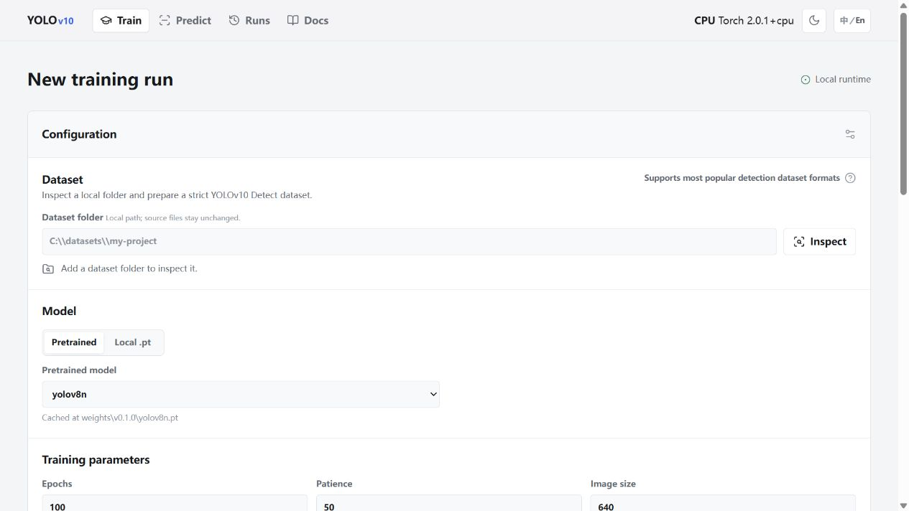
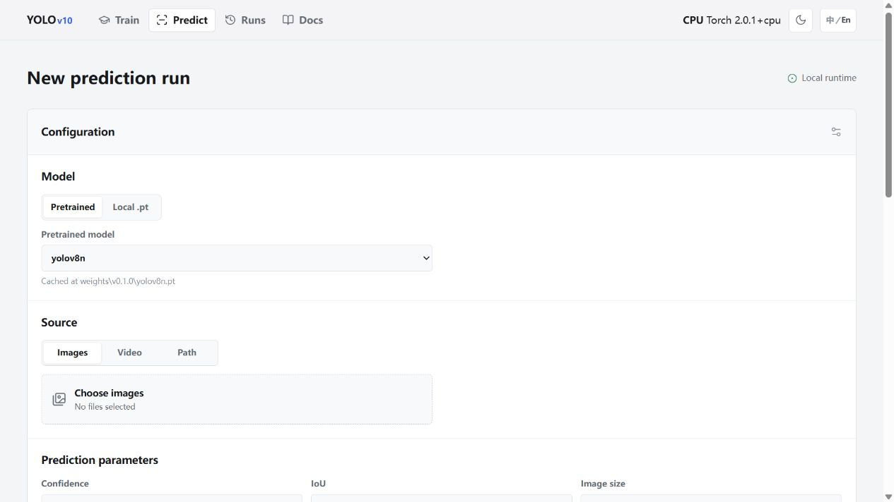
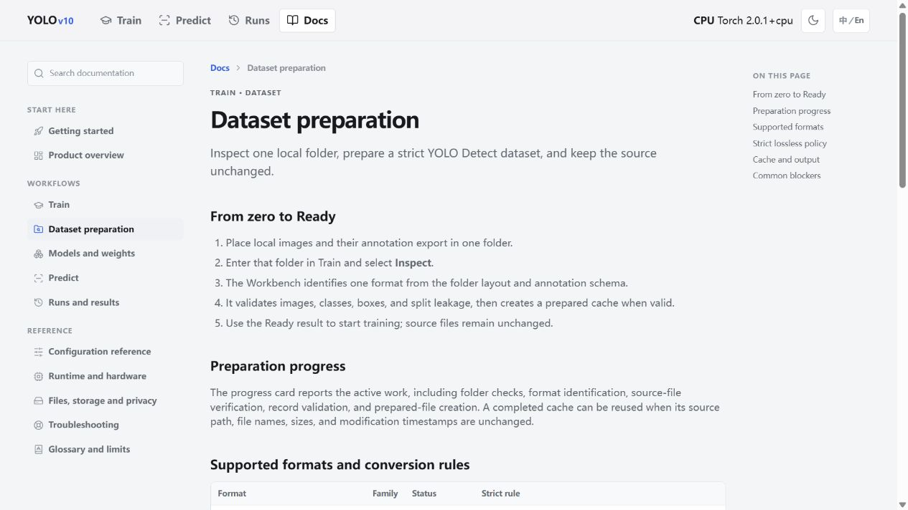

<div align="center">


# YOLO-WebUI

[中文](README.zh-CN.md) | **English**

<p><strong>A local-first visual workbench for preparing detection datasets, training YOLO models, and reviewing prediction results.</strong></p>

<p>
  
  
  
  
  
</p>

</div>

## Overview

YOLO-WebUI is a self-hosted interface for the local Ultralytics Detect workflow. It keeps datasets, model weights, run outputs, and logs on the machine where it runs. The application is designed for a focused single-user workflow rather than hosted collaboration or a multi-tenant service.

The repository contains the matching Ultralytics source tree. Run the service from this checkout so the UI and its bundled runtime stay aligned.

## Highlights

- **Dataset-first training:** enter a server-local folder or drag one `.zip` dataset archive into Train, then identify a supported detection format, validate it, and prepare a strict YOLO Detect cache.
- **Practical model handling:** choose a pretrained model with verified local caching, or use a local `.pt` file or upload.
- **Focused prediction:** run on image uploads, a video upload, or a local path. URL sources are intentionally not supported.
- **Resumable uploads:** dataset ZIPs, `.pt` models, images, and videos use sequential 8 MiB chunks, retry transient failures, persist progress across refreshes, and verify the complete SHA-256 checksum before use.
- **Visible run lifecycle:** one managed run at a time, with live status, command preview, logs, charts, weights, media previews, and a searchable run history.
- **Training metrics:** loss, detection quality, and learning-rate charts refresh after each epoch writes to `results.csv`. Both standard YOLO losses and YOLOv10's one-to-many/one-to-one losses are supported, including a visible first-epoch point and charts in saved runs.
- **Product documentation:** built-in Docs includes format conversion rules, parameter reference, runtime behavior, storage guidance, and recovery steps.
- **Bilingual interface:** the top-bar `中/En` control switches pages, documentation, dynamic messages, and chart labels together. Chinese technical fields include the original English term. Commands, raw training logs, and user filenames retain their original content.

## Screenshots

<table>
  <tr>
    <td width="50%" valign="top"><strong>Dataset preparation and training</strong><br><br></td>
    <td width="50%" valign="top"><strong>Image, video, and path prediction</strong><br><br></td>
  </tr>
  <tr>
    <td colspan="2" valign="top"><strong>In-product documentation</strong><br><br></td>
  </tr>
</table>

## Requirements

- Git
- [Conda](https://docs.conda.io/projects/conda/en/latest/user-guide/install/) (Miniconda or Anaconda)
- Windows, macOS, or Linux
- Optional: NVIDIA GPU

## Quick start

Choose exactly one of the three installation branches below. Each branch is a complete setup for a fresh checkout and uses a separate Conda environment. If `conda activate` is not available in the current shell, run `conda init` once and reopen the terminal before starting.

The PyTorch wheels include their CUDA runtime. The NVIDIA driver still needs to support that runtime; the system `nvcc` version alone does not select the wheel. Do not install more than one of these runtime requirement files into the same environment.

### NVIDIA: CUDA 12.8 or newer (Blackwell / RTX 50-series)

Use this branch for NVIDIA Blackwell GPUs, including RTX 50-series, or any NVIDIA driver that supports CUDA 12.8 or newer. It installs the `cu128` PyTorch wheels, which include `sm_120` support.

```bash
git clone https://github.com/LeoWang0814/YOLO-WebUI.git yolov10-webui
cd yolov10-webui

conda create -n yolov10-cu128 python=3.10 -y
conda activate yolov10-cu128

python -m pip install --upgrade pip
python -m pip install -r requirements-cuda128.txt
python -m pip install -e .

python -c "import torch; print(torch.__version__, torch.version.cuda, torch.cuda.get_arch_list(), torch.cuda.is_available(), torch.cuda.device_count())"
python app.py
```

The verification command should report CUDA `12.8`, an architecture list containing the installed GPU architecture (for RTX 50-series, `sm_120`), `True`, and the detected GPU count.

### NVIDIA: CUDA 11.8 to 12.7 (pre-Blackwell)

Use this branch for pre-Blackwell NVIDIA GPUs when the available driver/runtime is in the CUDA 11.8–12.7 range. The project installs the `cu118` PyTorch wheels from `requirements-cuda118.txt`; a separate system CUDA toolkit is not required.

```bash
git clone https://github.com/LeoWang0814/YOLO-WebUI.git yolov10-webui
cd yolov10-webui

conda create -n yolov10-cu118 python=3.10 -y
conda activate yolov10-cu118

python -m pip install --upgrade pip
python -m pip install -r requirements-cuda118.txt
python -m pip install -e .

python -c "import torch; print(torch.__version__, torch.version.cuda, torch.cuda.get_arch_list(), torch.cuda.is_available(), torch.cuda.device_count())"
python app.py
```

The verification command should report CUDA `11.8`, `True`, and the detected GPU count. Do not use this branch for RTX 50-series/Blackwell GPUs; use the CUDA 12.8 branch instead.

If `nvidia-smi` detects GPUs but PyTorch reports CUDA as unavailable, run the repository's runtime diagnostic:

```bash
python tools/check_cuda.py
```

When using Docker, launch the image with the NVIDIA runtime and pass the assigned GPUs through (`--gpus all` or `--gpus '"device=0,1"'`). The image requests both `compute` and `utility` driver capabilities; omitting `compute` can leave `nvidia-smi` working while `cuInit()` returns `CUDA_ERROR_UNKNOWN (999)`. A container where this still happens has a host/container driver-runtime problem; reinstalling Python packages inside that container cannot repair it. Recreate the container with the NVIDIA runtime or repair the host `nvidia_uvm` module and device mapping first.

### CPU only

Use this branch when no NVIDIA GPU is available or when CPU execution is preferred. It installs the CPU-only PyTorch wheels and does not require CUDA.

```bash
git clone https://github.com/LeoWang0814/YOLO-WebUI.git yolov10-webui
cd yolov10-webui

conda create -n yolov10-cpu python=3.10 -y
conda activate yolov10-cpu

python -m pip install --upgrade pip
python -m pip install -r requirements-cpu.txt
python -m pip install -e .

python -c "import torch; print(torch.__version__, torch.cuda.is_available())"
python app.py
```

The verification command should report `False` for CUDA availability. Open [http://127.0.0.1:7860](http://127.0.0.1:7860) after the service starts.

## Launch options

`python app.py` listens on `127.0.0.1:7860` by default. Set these environment variables before launching when a different address or port is needed.

| Purpose | Windows PowerShell | macOS / Linux |
| --- | --- | --- |
| Expose on the local network | `$env:YOLOV10_WEBUI_HOST="0.0.0.0"` | `export YOLOV10_WEBUI_HOST=0.0.0.0` |
| Use port 7862 | `$env:YOLOV10_WEBUI_PORT="7862"` | `export YOLOV10_WEBUI_PORT=7862` |
| Start the service | `python app.py` | `python app.py` |

For example, on Windows PowerShell:

```powershell
$env:YOLOV10_WEBUI_HOST="127.0.0.1"
$env:YOLOV10_WEBUI_PORT="7862"
python app.py
```

For a GPU server exposed through a provider port forward, bind the service to all interfaces and use the forwarded port directly:

```bash
export YOLOV10_WEBUI_HOST=0.0.0.0
export YOLOV10_WEBUI_PORT=6006
python app.py
```

The browser page and every upload request use this same port; no separate upload port or WebSocket tunnel is required.

> [!WARNING]
> Binding to `0.0.0.0` exposes the service to devices that can reach the machine. The Workbench has no authentication layer; use a private network or a reverse proxy with access control before sharing it.

## First workflow

1. Open **Train** and enter the server-local folder containing your images and annotations, or drag one local `.zip` dataset archive into the same field to upload and extract it on the Workbench host.
2. Select **Inspect**. The Workbench identifies the dataset format, validates records, and prepares a cache only when strict conversion is possible.
3. Select a pretrained model or provide a local `.pt` model. Configure the main training fields and review the generated command.
4. Start training. Watch live progress and logs; outputs are stored under `runs/train/`.
5. Open **Predict** to run the selected model on images, video, or a local path. Prediction outputs are stored under `runs/predict/`.
6. Review artifacts in **Runs**, or open **Docs** for complete in-product instructions and troubleshooting.

Uploads use sequential 8 MiB chunks with automatic retry, pause/continue controls, browser-refresh resume, and a full-file SHA-256 check before the file is accepted. The default per-file limit is 20 GiB and incomplete sessions are retained for seven days. Set `YOLOV10_UPLOAD_MAX_BYTES`, `YOLOV10_UPLOAD_CHUNK_BYTES`, and `YOLOV10_UPLOAD_RETENTION_SECONDS` before launch to adjust those defaults. The server also limits ZIP expansion with `YOLOV10_DATASET_UNCOMPRESSED_MAX_BYTES` and `YOLOV10_DATASET_MAX_FILES`.

Only one managed Ultralytics training or prediction process can run at a time. This prevents conflicting resource usage in the local runtime.

## Project layout

| Path | Purpose |
| --- | --- |
| `app.py` | FastAPI application and service entry point |
| `core/` | Dataset preparation, runtime, model, and run-management logic |
| `templates/` and `static/` | Workbench UI, styles, and client-side behavior |
| `web/` | Form schema and built-in documentation data |
| `runs/` | Generated train and predict artifacts (not committed) |
| `weights/` | Downloaded pretrained model cache (not committed) |
| `models/` | User-supplied local model uploads (not committed) |
| `datasets/uploads/` | Persistent dataset folders extracted from browser-uploaded ZIP archives (not committed) |
| `datasets/.upload-sessions/` | Resumable upload chunks and metadata, automatically cleaned after the retention period (not committed) |

Runtime directories are intentionally excluded from Git. This keeps uploaded datasets, models, checkpoints, logs, generated runs, and interrupted upload chunks out of commits while preserving the application code and documentation.

## Development

The service runs directly from the checkout. After activating your chosen Conda environment, install the development extras
before running the test suite:

```bash
pip install -e ".[dev]"
pytest -q
```

The [browser regression checks](tests/browser/README.md) cover language switching across pages and documentation, dynamic upload errors, and live chart rendering. They use Playwright with Chromium and mock training/upload responses; no GPU training or dataset changes are required. Node dependencies, browser reports, and test screenshots are excluded from Git.

## License

This repository is distributed under the [GNU Affero General Public License v3.0](LICENSE). Review the license before deploying a modified version as a network service.
