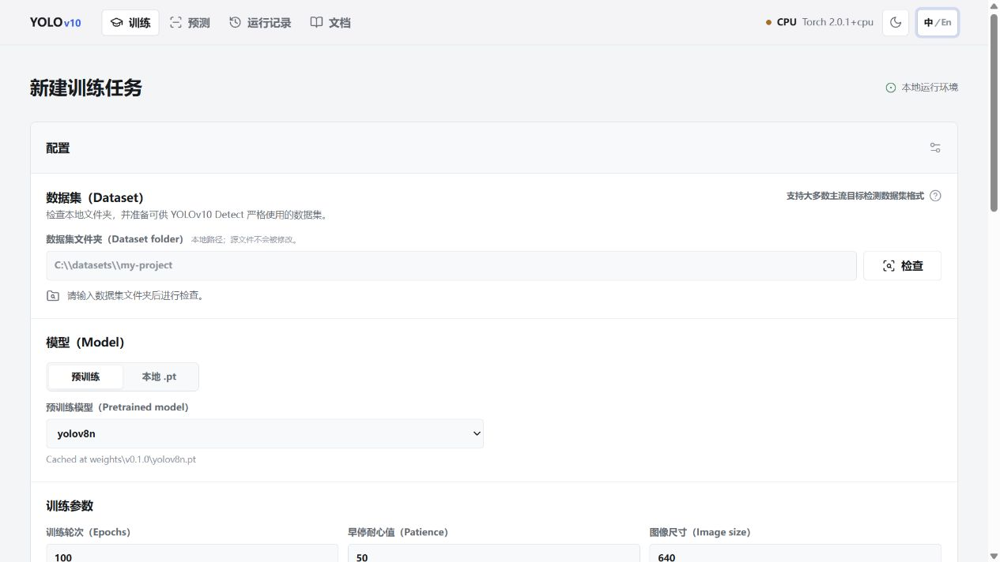
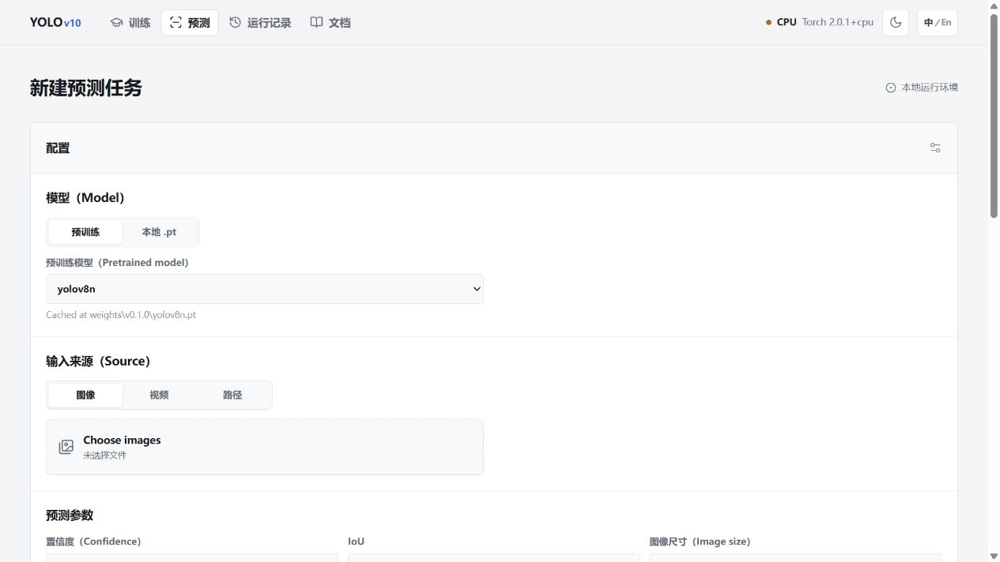
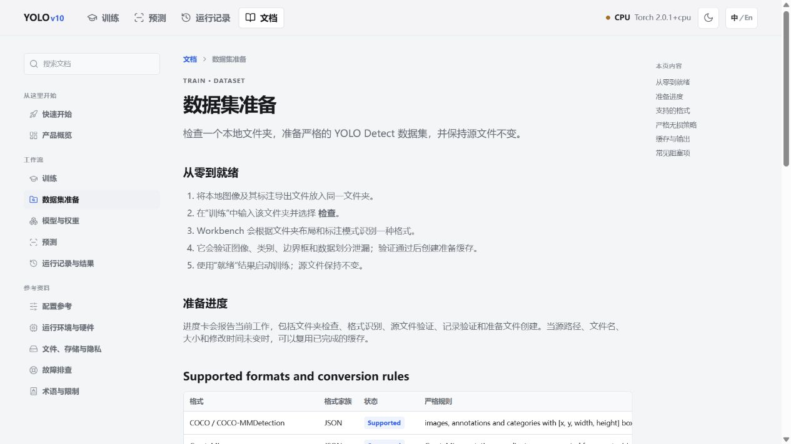

<div align="center">

# YOLO-WebUI

**中文** | [English](README.md)

<p><strong>一款本地优先的可视化工作台，用于准备检测数据集、训练 YOLO 模型并查看预测结果。</strong></p>

<p>
  
  
  
  
  
</p>

</div>

## 项目简介

YOLO-WebUI 是面向本地 Ultralytics Detect 工作流的自托管界面。数据集、模型权重、运行产物和日志均保留在运行它的机器上。它面向专注的单用户本地工作流，并非托管式协作或多租户服务。

仓库内包含匹配的 Ultralytics 源码。请从此仓库目录运行服务，以保持界面与内置运行时一致。

## 核心亮点

- **以数据集为中心的训练：** 检查一个本地文件夹，识别支持的检测数据格式，验证后准备严格的 YOLO Detect 缓存；源文件保持不变。
- **实用的模型管理：** 可选择带本地校验缓存的预训练模型，或使用本地 `.pt` 文件、上传模型。
- **专注的预测流程：** 支持图片上传、视频上传和本地路径；刻意不支持 URL 来源。
- **清晰的运行生命周期：** 同一时间只管理一个运行，提供实时状态、命令预览、日志、图表、权重、媒体预览和可搜索的运行历史。
- **产品级文档：** 内置 Docs 包含格式转换规则、参数参考、运行时行为、存储说明和恢复步骤。
- **双语界面：** 顶栏 `中/En` 控件初始跟随系统语言，并允许每个浏览器在英文与中文之间切换。

## 界面截图

<table>
  <tr>
    <td width="50%" valign="top"><strong>数据集准备与训练</strong><br><br></td>
    <td width="50%" valign="top"><strong>图片、视频与路径预测</strong><br><br></td>
  </tr>
  <tr>
    <td colspan="2" valign="top"><strong>产品内文档</strong><br><br></td>
  </tr>
</table>

## 环境要求

- Git
- **Python 3.10**（推荐且经过支持的基线版本）
- Windows、macOS 或 Linux
- 可选：驱动兼容 CUDA 11.8 的 NVIDIA GPU

> [!IMPORTANT]
> 默认依赖文件安装 CPU 版 PyTorch，适用于没有 NVIDIA CUDA 环境的机器。只有目标机器具备兼容的 NVIDIA 驱动时，才应选择 CUDA 11.8 依赖文件。

## 快速开始

### Windows PowerShell（CPU，默认）

```powershell
git clone https://github.com/LeoWang0814/YOLO-WebUI.git yolov10-workbench
cd yolov10-workbench

py -3.10 -m venv .venv
.\.venv\Scripts\Activate.ps1

python -m pip install --upgrade pip
python -m pip install -r requirements.txt

python app.py
```

打开 [http://127.0.0.1:7860](http://127.0.0.1:7860)。

### macOS 和 Linux（CPU，默认）

```bash
git clone https://github.com/LeoWang0814/YOLO-WebUI.git yolov10-workbench
cd yolov10-workbench

python3.10 -m venv .venv
source .venv/bin/activate

python -m pip install --upgrade pip
python -m pip install -r requirements.txt

python app.py
```

打开 [http://127.0.0.1:7860](http://127.0.0.1:7860)。

### NVIDIA CUDA 11.8

当目标机器具备与 CUDA 11.8 兼容的 NVIDIA 驱动时，请使用这套完整流程，而不要使用前述 CPU 安装步骤。

#### Windows PowerShell

```powershell
git clone https://github.com/LeoWang0814/YOLO-WebUI.git yolov10-workbench
cd yolov10-workbench

py -3.10 -m venv .venv
.\.venv\Scripts\Activate.ps1

python -m pip install --upgrade pip
python -m pip install -r requirements-cuda118.txt

python -c "import torch; print(torch.__version__, torch.cuda.is_available())"
python app.py
```

#### macOS 和 Linux

```bash
git clone https://github.com/LeoWang0814/YOLO-WebUI.git yolov10-workbench
cd yolov10-workbench

python3.10 -m venv .venv
source .venv/bin/activate

python -m pip install --upgrade pip
python -m pip install -r requirements-cuda118.txt

python -c "import torch; print(torch.__version__, torch.cuda.is_available())"
python app.py
```

CUDA 检查必须输出 `True`，再在 Workbench 中选择 GPU。启动后打开 [http://127.0.0.1:7860](http://127.0.0.1:7860)。

## 启动选项

`python app.py` 默认监听 `127.0.0.1:7860`。如需其他地址或端口，请在启动前设置以下环境变量。

| 用途 | Windows PowerShell | macOS / Linux |
| --- | --- | --- |
| 暴露到本地网络 | `$env:YOLOV10_WEBUI_HOST="0.0.0.0"` | `export YOLOV10_WEBUI_HOST=0.0.0.0` |
| 使用 7862 端口 | `$env:YOLOV10_WEBUI_PORT="7862"` | `export YOLOV10_WEBUI_PORT=7862` |
| 启动服务 | `python app.py` | `python app.py` |

Windows PowerShell 示例：

```powershell
$env:YOLOV10_WEBUI_HOST="127.0.0.1"
$env:YOLOV10_WEBUI_PORT="7862"
python app.py
```

> [!WARNING]
> 绑定至 `0.0.0.0` 会让能够连接这台机器的其他设备访问服务。Workbench 没有认证层；如需共享，请使用私有网络，或先部署带访问控制的反向代理。

## 首次使用流程

1. 打开 **训练（Train）**，输入包含图片与标注的文件夹路径。
2. 选择 **检查（Inspect）**。Workbench 会识别数据集格式、验证记录，并且仅在严格转换可行时准备缓存。
3. 选择预训练模型或提供本地 `.pt` 模型，配置主要训练字段并查看自动生成的命令。
4. 启动训练，查看实时进度和日志；产物保存在 `runs/train/`。
5. 打开 **预测（Predict）**，对图片、视频或本地路径运行模型；输出保存在 `runs/predict/`。
6. 在 **运行记录（Runs）** 中查看产物，或进入 **文档（Docs）** 阅读完整说明与故障排除指南。

任意时刻只能运行一个受 Workbench 管理的 Ultralytics 训练或预测进程，以避免本地运行时发生资源冲突。

## 项目结构

| 路径 | 作用 |
| --- | --- |
| `app.py` | FastAPI 应用与服务入口 |
| `core/` | 数据集准备、运行时、模型和运行管理逻辑 |
| `templates/` 与 `static/` | Workbench 界面、样式与客户端行为 |
| `web/` | 表单架构与内置文档数据 |
| `runs/` | 训练和预测产物（不提交） |
| `weights/` | 已下载的预训练模型缓存（不提交） |
| `models/` | 用户提供的本地模型上传文件（不提交） |

## 开发

服务可以直接从仓库目录运行。如需让外部脚本也以可编辑模式使用内置 `ultralytics` 包，请在安装运行时依赖后执行：

```bash
python -m pip install -e . --no-deps
pytest -q
```

## 许可证

本仓库使用 [GNU Affero General Public License v3.0](LICENSE)。将修改后的版本作为网络服务部署前，请先阅读许可证内容。
